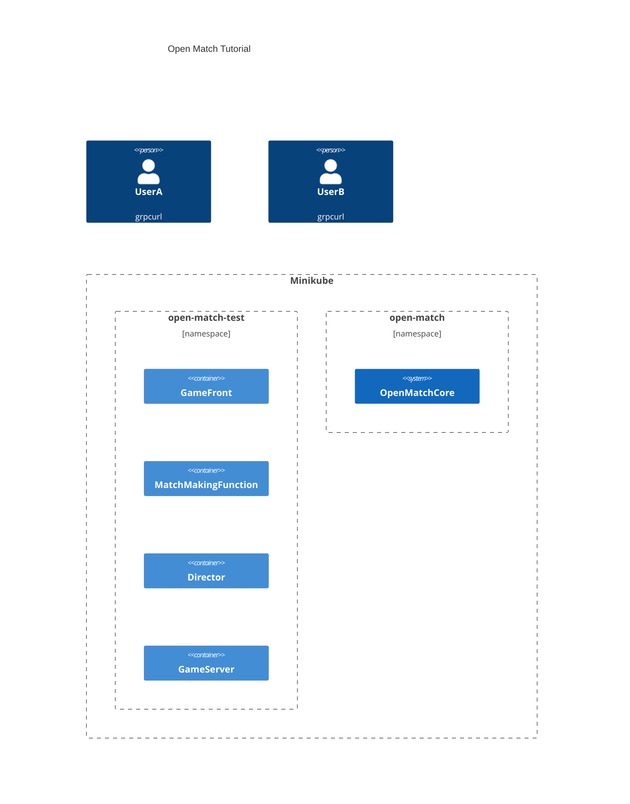

# OpenMatchTutorial
[Open Match](https://github.com/googleforgames/open-match) の backfill 機能を試すためのものです。以下の図のような構成を作り、[こちらのシナリオ](seq.md)のようなデモを行うことができます。




## prerequirements
- [helm](https://helm.sh/)
- [docker](https://www.docker.com/)
- local k8s, e.g. [minikube](https://minikube.sigs.k8s.io/)
- [grpcurl](https://github.com/fullstorydev/grpcurl)
- [jq](https://jqlang.github.io/jq/)

## 動かし方
### インストール
1. build images
    - run `make build`
2. install open match
    - run `CONTEXT=(k8s context) VERSION=(Open Match version) make install-openmatch`
      - CONTEXTは未指定の場合 open-match-test になります
      - VERSIONは未指定の場合 1.8.0 になります
3. apply manifests
    - run `make apply`

### マッチさせる
3人必要なゲームに、userAとuserBが参加し、時間切れを迎えてbotが追加されるというシナリオを考えます。

各リクエストによって何が起こるかは[シーケンス図](seq.md)を見てください。

最初に、userAをゲームに参加させるため、チケットを要求します。

`` TICKET_ID=`grpcurl -plaintext -d '{"name":"userA"}' (gemefront service ip):30021 gamefront.GameFrontService.EntryGame | jq .ticketId` ``

チケットのIDが得られたら、それをもってゲームサーバにアクセスします。

`grpcurl -plaintext -d "{\"ticket_id\":$TICKET_ID}" (gameserver service ip):30054 gameserver.GameServerService.Join`

うまくいった場合、以下の様なレスポンスが得られます。


```
{
  "members": [
    {
      "name": "userA",
      "ready": true
    }
  ]
}
```

ルームの情報が通知されるので、この接続は維持したまま別途userBを参加させます。

`` TICKET_ID=`grpcurl -plaintext -d '{"name":"userB"}' (gemefront service ip):30021 gamefront.GameFrontService.EntryGame | jq .ticketId` ``
`grpcurl -plaintext -d "{\"ticket_id\":$TICKET_ID}" (gameserver service ip):30054 gameserver.GameServerService.Join`

userBが参加すると、userA,userB共に以下のようなレスポンスが得られます。

```
{
  "members": [
    {
      "name": "userA",
      "ready": true
    },
    {
      "name": "userB",
      "ready": true
    }
  ]
}
```

このままマッチングのタイムアウトを迎えると、DGS側から募集が打ち切られ、botが追加されます。
userAとuserBは以下のようなレスポンスを受け取り、これで想定していたシナリオは終了になります。
```
{
  "members": [
    {
      "name": "userA",
      "ready": true
    },
    {
      "name": "userB",
      "ready": true
    },
    {
      "name": "bot1",
      "ready": true
    }
  ]
  "ready": true
}
```


## cleanup
`kubectl delete namespace open-match-test` を実行することでチュートリアル用のk8s componentsだけを削除することができます。

open match も uninstall する場合は `make clean` を実行してください。

