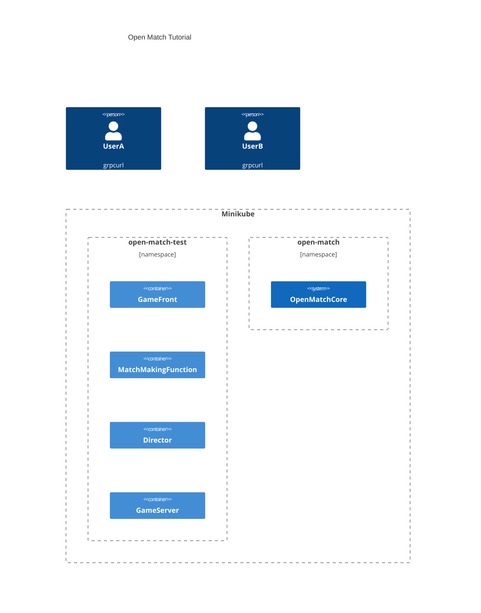

# OpenMatchTutorial
Test [Open Match](https://github.com/googleforgames/open-match) backfill.
Build matching system with Open Match for tutorial scenario like [this](seq.md).



## prerequirements
- [helm](https://helm.sh/)
- [docker](https://www.docker.com/)
- local k8s, e.g. [minikube](https://minikube.sigs.k8s.io/)
- [grpcurl](https://github.com/fullstorydev/grpcurl)
- [jq](https://jqlang.github.io/jq/)

## How to run
### install and setup components
1. build images
    - run `make build`
2. install open match
    - run `CONTEXT=(k8s context) VERSION=(Open Match version) make install-openmatch`
      - default CONTEXT is open-match-test
      - default VERSION is 1.8.0
3. apply manifests
    - run `make apply`

### request match making
First, run this command for request ticket:

`` TICKET_ID=`grpcurl -plaintext -d '{"name":"userA"}' (gemefront service ip):30021 gamefront.GameFrontService.EntryGame | jq .ticketId` ``

And next, join the DGS:

`grpcurl -plaintext -d "{\"ticket_id\":$TICKET_ID}" (gameserver service ip):30054 gameserver.GameServerService.Join`

If the request is succeeded, you got room state via stream like this:


```
{
  "members": [
    {
      "name": "userA",
      "ready": true
    }
  ]
}
```

UserA is ready now, so we'll have UserB join the DGS next:

`` TICKET_ID=`grpcurl -plaintext -d '{"name":"userB"}' (gemefront service ip):30021 gamefront.GameFrontService.EntryGame | jq .ticketId` ``
`grpcurl -plaintext -d "{\"ticket_id\":$TICKET_ID}" (gameserver service ip):30054 gameserver.GameServerService.Join`

UserA and UserB got response like this:

```
{
  "members": [
    {
      "name": "userA",
      "ready": true
    },
    {
      "name": "userB",
      "ready": true
    }
  ]
}
```

Now, the game has 2 participants but it requires 3. DGS add bots if the participants are not enough until timeout limit.

UserA and UserB got response when the bot was added. It means the room is ready.
```
{
  "members": [
    {
      "name": "userA",
      "ready": true
    },
    {
      "name": "userB",
      "ready": true
    },
    {
      "name": "bot1",
      "ready": true
    }
  ]
  "ready": true
}
```

## cleanup
If you cleanup only tutorial components, run `kubectl delete namespace open-match-test`.

`make clean` command uninstall Open Match too.

