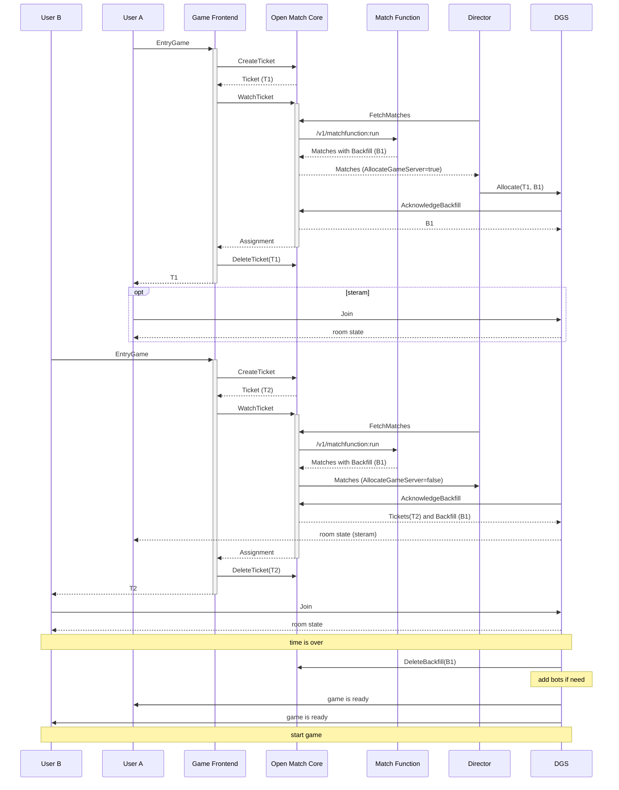

## matching sequence

```mermaid
sequenceDiagram
participant cliB as User B
participant cli as User A
participant f as Game Frontend
participant om as Open Match Core
participant mmf as Match Function
participant director as Director
participant dgs as DGS
cli ->>+ f: EntryGame
f ->> om: CreateTicket
om -->> f: Ticket (T1)
f ->>+ om: WatchTicket
director ->> om: FetchMatches
om ->> mmf: /v1/matchfunction:run
mmf -->> om: Matches with Backfill (B1)
om -->> director: Matches (AllocateGameServer=true)
director ->> dgs: Allocate(T1, B1)
dgs ->> om: AcknowledgeBackfill
om -->> dgs: B1
om -->>- f: Assignment
f ->> om: DeleteTicket(T1)
f -->>- cli: T1
opt steram
  cli ->> dgs: Join
  dgs -->> cli: room state
end
cliB ->>+ f: EntryGame
f ->> om: CreateTicket
om -->> f: Ticket (T2)
f ->>+ om: WatchTicket
director ->> om: FetchMatches
om ->> mmf: /v1/matchfunction:run
mmf -->> om: Matches with Backfill (B1)
om ->> director: Matches (AllocateGameServer=false)
dgs ->> om: AcknowledgeBackfill
om -->> dgs: Tickets(T2) and Backfill (B1)
dgs -->> cli: room state (steram)
om -->>- f: Assignment
f ->> om: DeleteTicket(T2)
f -->>- cliB: T2
cliB ->> dgs: Join
dgs -->> cliB: room state
Note over cliB,dgs: time is over
dgs ->> om: DeleteBackfill(B1)
note over dgs: add bots if need
dgs ->> cli: game is ready
dgs ->> cliB: game is ready
note over cliB,dgs: start game
```
